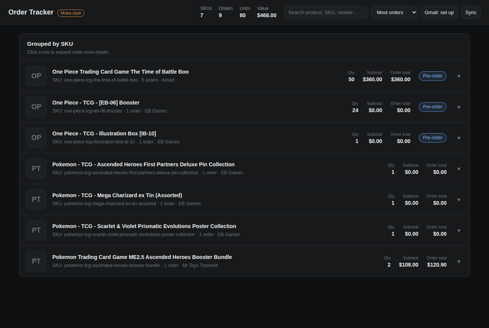

# Claude-moka-like

A local order tracker for trading-card / toy retailer orders, inspired by
[mokatracker.app](https://mokatracker.app/). It reads order-confirmation emails
(Kmart, Mr Toys Toyworld, …), normalizes each product into a canonical **SKU**,
and renders a **grouped-by-SKU** dark UI showing quantity, subtotal, order total,
pre-order and "mixed values" badges, with expandable per-order details.



## Why

Orders for the same product arrive across many emails, retailers, and buying
accounts. Reading them one by one is painful. This tool parses the emails,
collapses them into one row per product, and lets you see — at a glance — how
many units you have on order and across how many orders.

## Quick start

First install [Node.js](https://nodejs.org) (LTS, v18+). That's the only
prerequisite — the app itself has no dependencies to install.

**Easiest (no terminal):** double-click **`start.command`** (macOS/Linux) or
**`start.bat`** (Windows). It launches the server and opens your browser. On
macOS the first time, right-click → **Open** to get past the security prompt.

**Terminal:**

```bash
npm start          # serves http://localhost:3000
```

The repo ships with a seeded `data/db.json` (built from real parsed order
emails) so you'll see the grouped view immediately.

## How it works

```
email (HTML)  ─▶  parser (per retailer)  ─▶  order { items[] }  ─▶  db.json
                                                     │
                                          SKU normalization
                                                     │
                                            group by SKU  ─▶  /api/groups  ─▶  UI
```

- **`server/parsers/`** — one module per retailer (`kmart.js`, `mrtoys.js`).
  Each exports `matches(email)` and `parse(email)`. Add a retailer by dropping
  in a new module and registering it in `parsers/index.js`.
- **`server/sku.js`** — turns a product name into a canonical slug so the same
  product groups across retailers (e.g. "Trading Card Game" → "tcg", strips set
  codes like "ME2.5"). Supports manual aliases.
- **`server/grouping.js`** — aggregates line items by SKU: total qty, subtotal,
  order total, mixed-values + pre-order flags, distinct order/account counts.
- **`server/index.js`** — zero-dependency HTTP server (REST API + static UI).
- **`public/`** — the dark, Moka-style frontend (vanilla JS, no build step).

## Getting your orders in

### Option A — drop in email exports (works today)

Put email files in `data/emails/` then re-ingest:

```bash
npm run ingest         # or click "Sync" in the UI
```

Supported file types:

- `*.json` — a Gmail thread/message export, an array of email objects, or a
  single email object. Each message needs:
  `{ id, sender, subject, date, htmlBody, toRecipients }`.
- `*.html` — raw email HTML. Name it with a retailer hint so it routes to the
  right parser, e.g. `kmart__632783560.html`, `mrtoys__W00415265.html`.

### Option B — live Gmail sync (optional, scaffolded)

`server/gmail.js` contains a documented seam for pulling orders directly from
Gmail via OAuth. The MVP intentionally leaves it unimplemented so the app needs
no Google setup. To enable it:

1. Create a Google Cloud project, enable the Gmail API, make an OAuth **Desktop**
   client, and download the credentials JSON to `data/gmail-credentials.json`.
2. `npm install googleapis`
3. Implement `fetchOrderEmails()` in `server/gmail.js` and call `ingestEmails()`
   with the result (from a route or a cron). The search query already lists the
   in-scope retailers.

## Product images

Order emails don't contain real product images, so each SKU starts with an
initials placeholder. Click a thumbnail (or "Set product image" in the expanded
row) to upload an image — it's saved under `public/images/skus/<sku>.<ext>` and
remembered in `db.json`.

## API

| Method | Path                          | Purpose                                    |
| ------ | ----------------------------- | ------------------------------------------ |
| GET    | `/api/groups?sort=&dir=&q=`   | grouped-by-SKU list + totals               |
| GET    | `/api/orders`                 | all parsed orders                          |
| GET    | `/api/retailers`              | supported retailers                        |
| POST   | `/api/ingest`                 | re-ingest `data/emails/`                   |
| POST   | `/api/skus/:sku/image`        | set SKU image (`{ dataUrl }`)              |
| POST   | `/api/skus/:sku/meta`         | set `{ displayName?, notes? }`             |

`sort` ∈ `orders` (default) · `qty` · `value` · `name`.

## Tests

```bash
npm test     # node --test
```

## Project layout

```
server/
  index.js            HTTP server (API + static)
  db.js               JSON file store
  sku.js              product name → canonical SKU
  grouping.js         group orders by SKU
  ingest.js           parse + upsert emails (CLI: npm run ingest)
  gmail.js            optional live Gmail sync seam
  parsers/
    index.js          parser registry + SKU attachment
    kmart.js          Kmart Australia
    mrtoys.js         Mr Toys Toyworld
    util.js           HTML→text, money/date helpers
public/               dark Moka-style frontend
data/
  db.json             the store (seeded)
  emails/             drop email exports here
test/                 node:test suite
```
